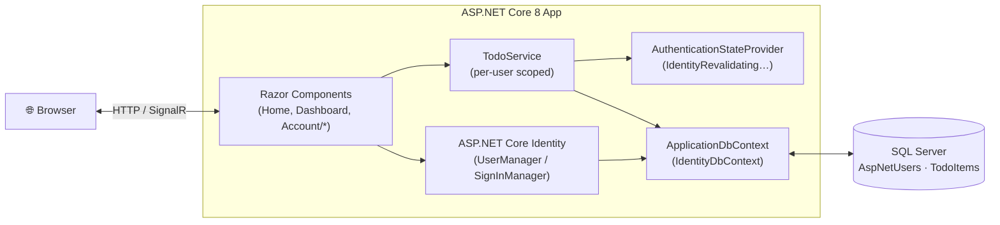
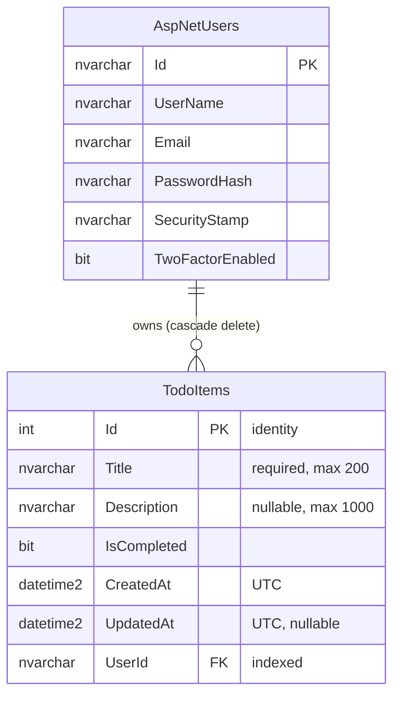

# ✓ Todo Manager

A full-stack, multi-user task management web app built with **ASP.NET Core 8 Blazor (Interactive Server)**, **Entity Framework Core 8**, **SQL Server**, and **ASP.NET Core Identity**.

Each user registers, signs in, and manages a private task list from a live dashboard. They can create, edit, complete, delete, and filter tasks, and the dashboard shows running statistics.


---

## 📑 Table of Contents

- [Overview](#-overview)
- [Features](#-features)
- [Screenshots](#-screenshots)
- [Tech Stack](#-tech-stack)
- [Architecture](#-architecture)
- [Project Structure](#-project-structure)
- [Getting Started](#-getting-started)
- [Configuration](#-configuration)
- [Database Schema](#-database-schema)
- [Routes](#-routes)
- [TodoService API](#-todoservice-api)
- [Authentication & Security](#-authentication--security)
- [Known Limitations & Roadmap](#-known-limitations--roadmap)
- [Contributing](#-contributing)
- [License](#-license)
- [Author](#-author)

---

## 🧭 Overview

Todo Manager started from the **Blazor Web App** template with *Individual Accounts* authentication. On top of it, the project adds:

- A `TodoItem` domain model, linked to the Identity user through a foreign key with cascade delete
- A `TodoService` that limits every query to the signed-in user
- An interactive `/dashboard` page with statistics cards, inline editing, and status filters
- A custom landing page, a dark top navbar, and restyled Login and Register pages

---

## ✨ Features

### Task management
- **Create tasks** with a required title (max 200 characters) and an optional description (max 1000 characters)
- **Edit tasks inline**: the row turns into a form, with Save and Cancel buttons
- **Mark tasks complete or incomplete** with a checkbox; completed tasks are shown struck through
- **Delete tasks** with one click
- **Filter** by **All**, **Active**, or **Completed**
- **Statistics cards** for Total, Pending, and Completed tasks, refreshed after every change
- **Timestamps**: each task shows when it was created and last updated, in the user's local time
- Tasks are listed newest first

### User experience
- Real-time updates over a SignalR circuit, with no full page reloads on the dashboard
- Loading spinner, empty-state message, and success/error alerts that can be dismissed
- Form validation with clear error messages (Data Annotations)
- Responsive layout using Bootstrap 5, with a collapsible navbar on mobile
- The navbar changes with sign-in state: it shows the username, Profile, and Logout when signed in, and Login and Register when signed out

### Accounts and security
- Registration and login through **ASP.NET Core Identity**, with hashed passwords
- **Per-user data isolation**: users can only read or change their own tasks
- Protected routes with `[Authorize]`; signed-out visitors are redirected to Login
- Security stamp is re-checked every 30 minutes while a circuit is open
- Built-in account management: change password, change email, two-factor authentication (authenticator app and recovery codes), and download or delete personal data
- Antiforgery protection and HTTPS redirection, plus HSTS in production

---

## 📸 Screenshots

> Screenshots are stored in the [`screenshots/`](screenshots/) folder.

### Landing Page
<!-- Replace with your screenshot -->


### Register


### Login


### Dashboard — Task List & Statistics


### Adding a Task


### Inline Editing


### Filtering (Active / Completed)


### Empty State


### Account Management (Profile)


### Mobile View
<p align="center">
  
  &nbsp;&nbsp;
  
</p>

---

## 🛠 Tech Stack

| Layer              | Technology                                                       |
| ------------------ | ---------------------------------------------------------------- |
| **Framework**      | ASP.NET Core 8.0 (`Microsoft.NET.Sdk.Web`, `net8.0`)             |
| **UI**             | Blazor Razor Components, Interactive Server render mode          |
| **Real-time**      | SignalR (Blazor Server circuit)                                  |
| **ORM**            | Entity Framework Core 8.0.17 (SQL Server provider)               |
| **Database**       | Microsoft SQL Server (SQLEXPRESS / LocalDB / full instance)      |
| **Authentication** | ASP.NET Core Identity 8.0.17, cookie-based                       |
| **Styling**        | Bootstrap 5.3 + custom CSS (`app.css`, scoped `.razor.css`)      |
| **Language**       | C# 12, with nullable reference types and implicit usings enabled |
| **IDE**            | Visual Studio 2022 (17.8+) or VS Code with C# Dev Kit            |

### NuGet packages

| Package                                               | Version |
| ----------------------------------------------------- | ------- |
| `Microsoft.AspNetCore.Identity.EntityFrameworkCore`   | 8.0.17  |
| `Microsoft.AspNetCore.Diagnostics.EntityFrameworkCore`| 8.0.17  |
| `Microsoft.EntityFrameworkCore.SqlServer`             | 8.0.17  |
| `Microsoft.EntityFrameworkCore.Design`                | 8.0.17  |
| `Microsoft.EntityFrameworkCore.Tools`                 | 8.0.17  |

---

## 🏗 Architecture



**Request flow for a dashboard action (for example, toggling a task):**

1. The user clicks the checkbox. Blazor sends the event to the server over SignalR.
2. `Dashboard.razor` calls `TodoService.ToggleCompleteAsync(id)`.
3. `TodoService` gets the current user's ID from `AuthenticationStateProvider` (the `NameIdentifier` claim).
4. It loads the task **only if** `Id == id && UserId == currentUser`, flips `IsCompleted`, sets `UpdatedAt`, and saves.
5. The dashboard reloads the list and stats, and Blazor sends only the changed parts of the page back to the browser.

### Layers

| Layer          | Location                  | Role                                                           |
| -------------- | ------------------------- | -------------------------------------------------------------- |
| Presentation   | `Components/`             | Razor pages, layout, navbar, and Identity UI                   |
| Business logic | `Services/TodoService.cs` | Task CRUD, filtering, and statistics, always limited to the current user |
| Data access    | `Data/`                   | EF Core `DbContext`, Identity user, migrations                 |
| Domain         | `Models/TodoItem.cs`      | Task entity with validation attributes                         |

---

## 📂 Project Structure

```
TodoApp/
├── TodoApp.sln                         # Visual Studio solution
├── README.md
├── screenshots/                        # README images (add your own)
└── TodoApp/
    ├── TodoApp.csproj                  # .NET 8 web project
    ├── Program.cs                      # DI, Identity, EF Core and middleware setup
    ├── appsettings.json                # Connection string and logging
    ├── appsettings.Development.json
    │
    ├── Models/
    │   └── TodoItem.cs                 # Task entity
    │
    ├── Data/
    │   ├── ApplicationDbContext.cs     # IdentityDbContext + TodoItems DbSet
    │   ├── ApplicationUser.cs          # Extends IdentityUser
    │   └── Migrations/
    │       ├── 00000000000000_CreateIdentitySchema.cs
    │       ├── 20260715122502_InitialCreate.cs     # Creates TodoItems
    │       ├── 20260715131322_AddTodoFields.cs     # Adds fields, FK and index
    │       └── ApplicationDbContextModelSnapshot.cs
    │
    ├── Services/
    │   └── TodoService.cs              # Per-user task business logic
    │
    ├── Components/
    │   ├── App.razor                   # Root HTML document
    │   ├── Routes.razor                # Router + AuthorizeRouteView
    │   ├── _Imports.razor
    │   ├── Layout/
    │   │   ├── MainLayout.razor(.css)  # Page shell
    │   │   └── NavMenu.razor(.css)     # Top navbar that changes with sign-in state
    │   ├── Pages/
    │   │   ├── Home.razor              # Landing page   (/)
    │   │   ├── Dashboard.razor         # Task dashboard (/dashboard) 🔒
    │   │   ├── Logout.razor            # Sign out       (/logout)
    │   │   ├── Auth.razor              # Auth test page (/auth) 🔒
    │   │   ├── Counter.razor           # Template sample
    │   │   ├── Weather.razor           # Template sample
    │   │   └── Error.razor
    │   └── Account/                    # ASP.NET Core Identity UI (Blazor)
    │       ├── Pages/                  # Login, Register, 2FA, password reset…
    │       │   └── Manage/             # Profile, email, password, 2FA, personal data
    │       ├── Shared/                 # Account layouts, StatusMessage, RedirectToLogin
    │       └── Identity*.cs            # Redirect manager, user accessor, revalidation,
    │                                   # no-op email sender, extra endpoints
    ├── Properties/
    │   └── launchSettings.json         # http / https / IIS Express profiles
    └── wwwroot/
        ├── app.css                     # Custom styles (hero, cards, dashboard)
        ├── favicon.png
        └── bootstrap/                  # Bootstrap 5 CSS
```

---

## 🚀 Getting Started

### Prerequisites

- [.NET 8 SDK](https://dotnet.microsoft.com/download/dotnet/8.0)
- [SQL Server Express](https://www.microsoft.com/sql-server/sql-server-downloads), LocalDB, or any SQL Server instance
- *(Optional)* [Visual Studio 2022](https://visualstudio.microsoft.com/) 17.8+ with the **ASP.NET and web development** workload
- EF Core CLI tools:

  ```bash
  dotnet tool install --global dotnet-ef
  ```

### 1. Clone the repository

```bash
git clone https://github.com/<your-username>/TodoApp.git
cd TodoApp
```

### 2. Configure the database connection

Edit `TodoApp/appsettings.json`. The default setting uses a local **SQLEXPRESS** instance with Windows authentication:

```json
"ConnectionStrings": {
  "DefaultConnection": "Server=localhost\\SQLEXPRESS;Database=aspnet-TodoApp-e6e80f4e-3349-4d82-b108-3f308bfbbc49;Trusted_Connection=True;TrustServerCertificate=True;MultipleActiveResultSets=true"
}
```

You can rename the database, for example `Database=TodoAppDb`. Other common options:

| Setup                    | Connection string                                                                                             |
| ------------------------ | ------------------------------------------------------------------------------------------------------------- |
| LocalDB                  | `Server=(localdb)\\mssqllocaldb;Database=TodoAppDb;Trusted_Connection=True;MultipleActiveResultSets=true`      |
| SQL login / Docker       | `Server=localhost,1433;Database=TodoAppDb;User Id=sa;Password=<YourPassword>;TrustServerCertificate=True`      |

> 💡 Don't commit real passwords. Use [User Secrets](https://learn.microsoft.com/aspnet/core/security/app-secrets) for local work, since the project already has a `UserSecretsId`:
> ```bash
> cd TodoApp
> dotnet user-secrets set "ConnectionStrings:DefaultConnection" "<your-connection-string>"
> ```

### 3. Create the database

```bash
cd TodoApp
dotnet ef database update
```

This applies all three migrations and creates the Identity tables and the `TodoItems` table.

### 4. Run the app

```bash
dotnet run --launch-profile https
```

Or open `TodoApp.sln` in Visual Studio and press **F5**.

| Profile       | URL                                               |
| ------------- | ------------------------------------------------- |
| `http`        | http://localhost:5262                             |
| `https`       | https://localhost:7128 (also http://localhost:5262) |
| `IIS Express` | http://localhost:36759 (SSL port 44377)           |

### 5. Try it out

1. Open the app and click **Register**.
2. Create an account. The password needs at least 6 characters, including a digit and a lowercase letter.
3. You are signed in right away, because email confirmation is turned off.
4. Go to **Dashboard** and add your first task.

---

## ⚙ Configuration

### Identity options (`Program.cs`)

| Option                            | Value   | Meaning                                  |
| --------------------------------- | ------- | ---------------------------------------- |
| `SignIn.RequireConfirmedAccount`  | `false` | Users can sign in without confirming their email |
| `Password.RequiredLength`         | `6`     | Minimum password length                  |
| `Password.RequireDigit`           | `true`  | Must contain at least one digit `0-9`    |
| `Password.RequireLowercase`       | `true`  | Must contain at least one lowercase letter |
| `Password.RequireUppercase`       | `false` | Uppercase letters are optional           |
| `Password.RequireNonAlphanumeric` | `false` | Symbols are optional                     |

### Registered services

| Service                                   | Lifetime  | Purpose                                     |
| ----------------------------------------- | --------- | ------------------------------------------- |
| `ApplicationDbContext`                    | Scoped    | EF Core context (SQL Server)                |
| `TodoService`                             | Scoped    | Task business logic                         |
| `IdentityRevalidatingAuthenticationStateProvider` | Scoped | Re-checks the security stamp every 30 minutes |
| `IdentityUserAccessor` / `IdentityRedirectManager` | Scoped | Helpers for the Identity pages        |
| `IdentityNoOpEmailSender`                 | Singleton | Placeholder email sender that doesn't send anything |

### Middleware pipeline

`MigrationsEndPoint` (Development) / `ExceptionHandler` + `HSTS` (Production) → `HttpsRedirection` → `StaticFiles` → `Antiforgery` → `Authentication` → `Authorization` → `MapRazorComponents<App>().AddInteractiveServerRenderMode()` → `MapAdditionalIdentityEndpoints()`

---

## 🗄 Database Schema



The standard Identity tables (`AspNetRoles`, `AspNetUserClaims`, `AspNetUserLogins`, `AspNetUserRoles`, `AspNetUserTokens`, `AspNetRoleClaims`) are created as well.

### Migrations

| Migration                                | Description                                                        |
| ---------------------------------------- | ------------------------------------------------------------------ |
| `00000000000000_CreateIdentitySchema`    | ASP.NET Core Identity tables                                       |
| `20260715122502_InitialCreate`           | Creates the `TodoItems` table                                      |
| `20260715131322_AddTodoFields`           | Adds `Title` and `Description` limits, `CreatedAt`, `UpdatedAt`, `UserId`, the `IX_TodoItems_UserId` index, and the FK to `AspNetUsers` |

---

## 🧭 Routes

| Route                       | Component            | Auth | Render mode          | Description                         |
| --------------------------- | -------------------- | :--: | -------------------- | ----------------------------------- |
| `/`                         | `Home.razor`         |  —   | Static SSR           | Landing page, with calls to action that change with sign-in state |
| `/dashboard`                | `Dashboard.razor`    |  🔒  | Interactive Server   | Task management dashboard           |
| `/logout`                   | `Logout.razor`       |  —   | Static SSR           | Signs the user out and redirects to `/` |
| `/auth`                     | `Auth.razor`         |  🔒  | Static SSR           | "You are authenticated" test page   |
| `/Account/Login`            | `Login.razor`        |  —   | Static SSR           | Sign-in form (custom styling)       |
| `/Account/Register`         | `Register.razor`     |  —   | Static SSR           | Sign-up form (custom styling)       |
| `/Account/Manage/*`         | Identity Manage UI   |  🔒  | Static SSR           | Profile, email, password, 2FA, personal data |
| `/counter`, `/weather`      | Template samples     |  —   | Interactive / Stream | Default Blazor template demo pages  |

---

## 📘 TodoService API

`Services/TodoService.cs` holds all task logic. **Every method looks up the current user ID first and filters on it**, so one user can never see or change another user's tasks.

```csharp
// Returns the current user's todos, newest first.
// filter: null | "all" → everything, "active" → not completed, "completed" → completed
Task<List<TodoItem>> GetTodosAsync(string? filter = null);

// Returns (Total, Completed, Pending) counts for the current user.
Task<(int Total, int Completed, int Pending)> GetStatsAsync();

// Returns a todo only if it belongs to the current user, otherwise null.
Task<TodoItem?> GetByIdAsync(int id);

// Creates a todo; trims input, stores empty descriptions as null.
// Throws InvalidOperationException if no user is signed in.
Task<TodoItem> CreateAsync(string title, string? description);

// Updates title/description and sets UpdatedAt. Returns false if not found or not owned.
Task<bool> UpdateAsync(int id, string title, string? description);

// Flips IsCompleted and sets UpdatedAt. Returns false if not found or not owned.
Task<bool> ToggleCompleteAsync(int id);

// Deletes a todo. Returns false if not found or not owned.
Task<bool> DeleteAsync(int id);
```

---

## 🔐 Authentication & Security

1. **Register**: Identity hashes the password (PBKDF2) and stores the user in `AspNetUsers`.
2. **Login**: `SignInManager.PasswordSignInAsync` validates the credentials and sets the `.AspNetCore.Identity.Application` cookie.
3. **Authorize**: `AuthorizeRouteView` in `Routes.razor` sends signed-out visitors to `/Account/Login` through `RedirectToLogin`.
4. **Revalidate**: `IdentityRevalidatingAuthenticationStateProvider` re-checks the user's security stamp every **30 minutes** on open circuits, so a password change signs out other sessions.
5. **Isolate data**: `TodoService` filters every query by `UserId`, and the database enforces ownership with an FK and cascade delete.
6. **Logout**: `/logout` calls `SignInManager.SignOutAsync()` and redirects home.

---

## 🚧 Known Limitations & Roadmap

These are known gaps and ideas for future work:

- [ ] **Email delivery**: `IdentityNoOpEmailSender` doesn't send real emails, so password reset and email confirmation don't deliver anything. Connect SMTP, SendGrid, or another provider.
- [ ] **Account lockout**: login calls `PasswordSignInAsync` with `lockoutOnFailure: false`. Turning it on would slow down brute-force attempts.
- [ ] **DbContext lifetime**: on Blazor Server, a scoped `DbContext` lives for the whole circuit. Switching to `IDbContextFactory<ApplicationDbContext>` is the [recommended pattern](https://learn.microsoft.com/aspnet/core/blazor/blazor-ef-core).
- [ ] **Stats query**: `GetStatsAsync` loads all of the user's tasks into memory to count them. Doing the counts in SQL would scale better.
- [ ] **Delete confirmation**: tasks are deleted immediately, with no confirmation prompt.
- [ ] **Template leftovers**: `Counter`, `Weather`, `Auth`, and the empty `Component*.razor` files can be removed.
- [ ] **Features to add**: due dates, priorities, categories and tags, search, pagination, drag-and-drop ordering, dark mode
- [ ] **Testing and CI**: unit tests for `TodoService` (EF Core InMemory or SQLite) and a GitHub Actions build workflow
- [ ] **Deployment**: Dockerfile and an Azure App Service + Azure SQL guide

---

## 🤝 Contributing

1. Fork the repository.
2. Create a feature branch: `git checkout -b feature/my-feature`
3. Commit your changes: `git commit -m "Add my feature"`
4. Push the branch: `git push origin feature/my-feature`
5. Open a Pull Request.

---

## 📄 License

This project is released under the **MIT License**. See [LICENSE](LICENSE.txt) for details.

---

## 👤 Author

**Hajira Gul**
Built as part of the **FFC Internship** program.

- GitHub: [@your-username](https://github.com/your-username)

<p align="center">Built with ❤️ using Blazor &amp; .NET 8</p>
